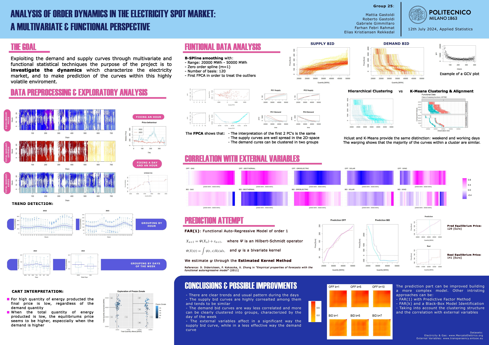

# Analysis of Order Dynamics in the Electricity Spot Market

This repository contains a statistical and inferential analysis of the Italian electricity market trends, focusing on Zonal Price data recorded in 2022 and 2023.

## Abstract
This project investigates the dynamics of the electricity market by analyzing supply and demand bid curves through multivariate and functional statistical techniques. Given the large volume of available data, the analysis begins with a preprocessing and exploratory phase based on summary variables, employing univariate and multivariate methods such as ANOVA and CART to identify relevant trends and structural patterns.
The study then adopts a Functional Data Analysis (FDA) framework, treating supply and demand bids as entire curves rather than discrete observations. Techniques such as smoothing, Functional Principal Component Analysis (fPCA), and Functional k-means clustering are used to capture the main modes of variability and identify recurring structures within the curves. The relationship between market behavior and external factors is further explored by analyzing the covariance structure between the bid curves and variables such as gas prices and renewable energy production.
Finally, a predictive approach is developed using a Functional Autoregressive model (FAR) to exploit temporal dependencies among curves. The results reveal clear daily patterns driven by the interaction between produced and demanded quantities. Supply bid curves show strong correlation and structural similarity, whereas demand curves exhibit greater variability and can be grouped into two clusters associated with the day of the week. External variables significantly influence supply curves, while their impact on demand appears weaker, partly due to the use of renewable production instead of renewable load as an explanatory variable. The FAR(1) model provides reasonable predictions for supply curves but proves too simplistic for demand curves, resulting in larger forecasting errors.

## Preview

## WARNING
> **IMPORTANT:** The folders `DatasetXML` and `DatasetCSV` are not present in this repository due to privacy policy.

## Repository Structure
* **docs/**: Full documentation (Poster.pdf) of results, methodology, and statistical conclusions.
* **scripts/**: R source code used for data processing, curve reconstruction, and functional time series modeling.

## License and Usage Policy
All files in this repository, including the report text and the images in the `results` folder, are subject to the following terms:

1. **Academic & Personal Use**: You are free to use, copy, and distribute these files for non-commercial purposes, provided that appropriate credit is given to the original author.
2. **Commercial Use**: Reproduction or use of the contents for profit is strictly prohibited without explicit written consent.
3. **Disclaimer**: The data and analyses are provided "as is." The author assumes no responsibility for financial or operational decisions made based on the findings of this study.

